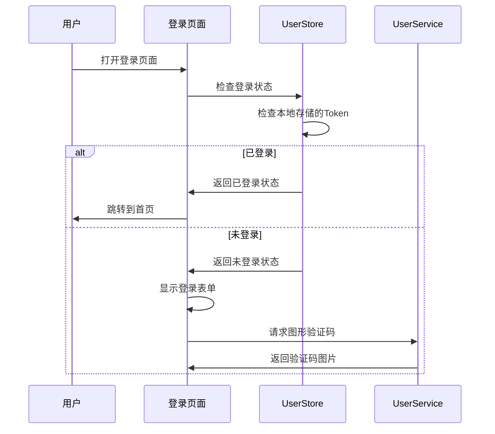
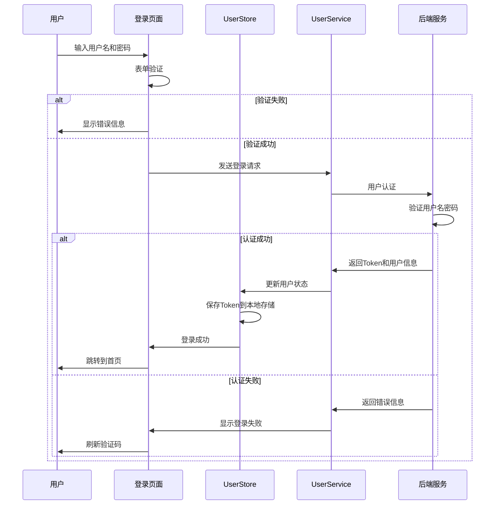
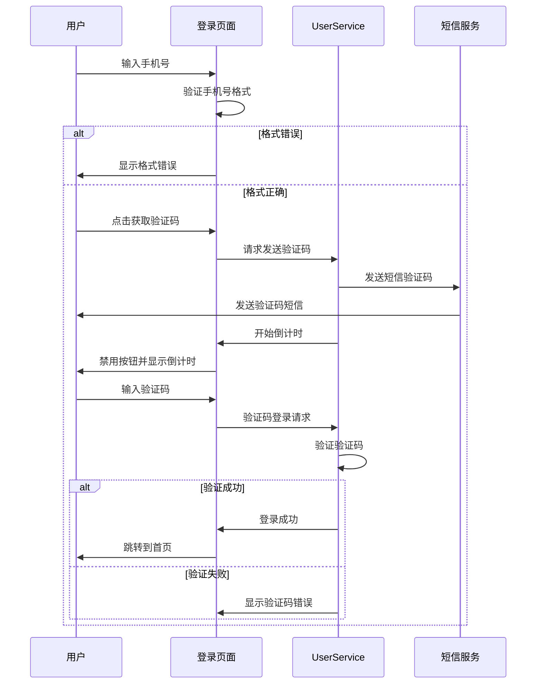

# 登录页面交互逻辑设计

## 概述

登录页面是用户进入交易应用的第一道门，需要提供安全、便捷的用户认证体验。本文档详细描述了登录页面的交互逻辑、用户流程和技术实现方案。

## 功能需求

### 核心功能
1. **用户名/密码登录** - 基础认证方式
2. **手机号验证码登录** - 快速登录方式
3. **图形验证码** - 防止恶意登录
4. **记住密码** - 提升用户体验
5. **自动登录** - 减少重复登录
6. **忘记密码** - 密码恢复功能
7. **新用户注册** - 账户创建入口

### 安全功能
1. **登录次数限制** - 防止暴力破解
2. **IP地址检测** - 异常登录提醒
3. **设备识别** - 新设备验证
4. **会话管理** - Token自动刷新
5. **登录历史记录** - 安全审计

## 页面结构

### 界面布局
```
┌─────────────────────────────────────┐
│            Logo区域                  │
├─────────────────────────────────────┤
│           登录方式切换               │
│  [用户名登录] [手机号登录]           │
├─────────────────────────────────────┤
│                                     │
│           登录表单区域               │
│  ┌─────────────────────────────┐   │
│  │ 用户名/手机号输入框         │   │
│  └─────────────────────────────┘   │
│  ┌─────────────────────────────┐   │
│  │ 密码/验证码输入框           │   │
│  └─────────────────────────────┘   │
│  ┌─────────────────────────────┐   │
│  │ 图形验证码 (可选)           │   │
│  └─────────────────────────────┘   │
│                                     │
├─────────────────────────────────────┤
│           选项区域                   │
│  [ ] 记住密码    [ ] 自动登录        │
├─────────────────────────────────────┤
│           操作按钮                   │
│  [         登录         ]           │
├─────────────────────────────────────┤
│           辅助链接                   │
│  忘记密码？  新用户注册             │
├─────────────────────────────────────┤
│           其他登录方式               │
│  [微信登录] [支付宝登录]            │
└─────────────────────────────────────┘
```

## 交互流程

### 1. 页面初始化流程


### 2. 用户名登录流程


### 3. 手机号验证码登录流程


## 状态管理

### 页面状态
```typescript
interface LoginPageState {
  // 登录方式
  loginType: 'username' | 'phone'
  
  // 表单数据
  form: {
    username: string
    password: string
    phone: string
    captcha: string
    smsCode: string
  }
  
  // 验证码
  captchaImage: string
  captchaKey: string
  smsCountdown: number
  
  // 选项
  rememberPassword: boolean
  autoLogin: boolean
  
  // 状态
  loading: boolean
  error: string | null
  loginAttempts: number
  
  // 表单验证
  validation: {
    username: boolean
    password: boolean
    phone: boolean
    captcha: boolean
    smsCode: boolean
  }
}
```

### 事件处理
```typescript
interface LoginEvents {
  // 登录方式切换
  onLoginTypeChange: (type: 'username' | 'phone') => void
  
  // 表单输入
  onUsernameInput: (username: string) => void
  onPasswordInput: (password: string) => void
  onPhoneInput: (phone: string) => void
  onCaptchaInput: (captcha: string) => void
  onSmsCodeInput: (code: string) => void
  
  // 验证码操作
  onRefreshCaptcha: () => void
  onSendSmsCode: () => void
  
  // 选项操作
  onRememberPasswordChange: (checked: boolean) => void
  onAutoLoginChange: (checked: boolean) => void
  
  // 登录操作
  onLogin: () => void
  onForgotPassword: () => void
  onRegister: () => void
  
  // 第三方登录
  onWechatLogin: () => void
  onAlipayLogin: () => void
}
```

## 验证规则

### 输入验证
```typescript
const validationRules = {
  username: {
    required: true,
    minLength: 3,
    maxLength: 20,
    pattern: /^[a-zA-Z0-9_]+$/,
    message: '用户名必须是3-20位字母、数字或下划线'
  },
  
  password: {
    required: true,
    minLength: 6,
    maxLength: 20,
    pattern: /^(?=.*[a-z])(?=.*[A-Z])(?=.*\d)[a-zA-Z\d@$!%*?&]{6,20}$/,
    message: '密码必须包含大小写字母和数字，长度6-20位'
  },
  
  phone: {
    required: true,
    pattern: /^1[3-9]\d{9}$/,
    message: '请输入正确的手机号码'
  },
  
  captcha: {
    required: true,
    length: 4,
    pattern: /^[A-Za-z0-9]{4}$/,
    message: '请输入4位验证码'
  },
  
  smsCode: {
    required: true,
    length: 6,
    pattern: /^\d{6}$/,
    message: '请输入6位数字验证码'
  }
}
```

### 实时验证
```typescript
const validateField = (field: string, value: string): boolean => {
  const rule = validationRules[field]
  if (!rule) return true
  
  // 必填验证
  if (rule.required && !value.trim()) {
    return false
  }
  
  // 长度验证
  if (rule.minLength && value.length < rule.minLength) {
    return false
  }
  
  if (rule.maxLength && value.length > rule.maxLength) {
    return false
  }
  
  // 格式验证
  if (rule.pattern && !rule.pattern.test(value)) {
    return false
  }
  
  return true
}
```

## 错误处理

### 常见错误类型
```typescript
const errorTypes = {
  // 网络错误
  NETWORK_ERROR: '网络连接失败，请检查网络设置',
  
  // 服务器错误
  SERVER_ERROR: '服务器繁忙，请稍后再试',
  
  // 认证错误
  INVALID_CREDENTIALS: '用户名或密码错误',
  USER_NOT_FOUND: '用户不存在',
  ACCOUNT_LOCKED: '账户已被锁定，请联系客服',
  
  // 验证码错误
  INVALID_CAPTCHA: '图形验证码错误',
  CAPTCHA_EXPIRED: '验证码已过期',
  INVALID_SMS_CODE: '短信验证码错误',
  SMS_CODE_EXPIRED: '短信验证码已过期',
  SMS_SEND_FAILED: '短信发送失败',
  
  // 频率限制
  TOO_MANY_ATTEMPTS: '登录次数过多，请稍后再试',
  SMS_LIMIT_EXCEEDED: '短信发送频率过高，请稍后再试'
}
```

### 错误处理策略
```typescript
const handleError = (error: any): string => {
  const errorCode = error.response?.data?.code
  const errorMessage = error.response?.data?.message
  
  // 根据错误码返回用户友好的错误信息
  switch (errorCode) {
    case '1001': return errorTypes.INVALID_CREDENTIALS
    case '1002': return errorTypes.USER_NOT_FOUND
    case '1003': return errorTypes.ACCOUNT_LOCKED
    case '2001': return errorTypes.INVALID_CAPTCHA
    case '2002': return errorTypes.CAPTCHA_EXPIRED
    case '3001': return errorTypes.INVALID_SMS_CODE
    case '3002': return errorTypes.SMS_CODE_EXPIRED
    case '4001': return errorTypes.TOO_MANY_ATTEMPTS
    case '4002': return errorTypes.SMS_LIMIT_EXCEEDED
    default: return errorMessage || errorTypes.SERVER_ERROR
  }
}
```

## 安全措施

### 前端安全
1. **密码强度检查** - 实时验证密码复杂度
2. **输入过滤** - 防止XSS攻击
3. **CSRF防护** - 使用Token验证
4. **登录次数限制** - 防止暴力破解
5. **验证码机制** - 防止自动化攻击

### 后端安全
1. **密码加密** - bcrypt哈希存储
2. **Token认证** - JWT Token验证
3. **会话管理** - Token过期和刷新机制
4. **IP白名单** - 异常IP检测
5. **设备指纹** - 新设备验证

## 性能优化

### 本地存储
```typescript
// 记住密码功能
const saveCredentials = (username: string, password: string) => {
  if (rememberPassword.value) {
    const encrypted = encrypt(password)
    storage.set('login_credentials', {
      username,
      password: encrypted,
      timestamp: Date.now()
    })
  }
}

// 自动登录功能
const checkAutoLogin = () => {
  if (autoLogin.value) {
    const credentials = storage.get('login_credentials')
    if (credentials && Date.now() - credentials.timestamp < 7 * 24 * 60 * 60 * 1000) {
      // 7天内自动登录
      return credentials
    }
  }
  return null
}
```

### 请求优化
```typescript
// 防抖处理
const debounceLogin = debounce(async () => {
  if (isFormValid.value) {
    await handleLogin()
  }
}, 300)

// 请求缓存
const captchaCache = new Map()
const getCaptchaImage = async () => {
  const cacheKey = 'login_captcha'
  if (captchaCache.has(cacheKey)) {
    return captchaCache.get(cacheKey)
  }
  
  const response = await userService.getCaptcha()
  captchaCache.set(cacheKey, response.data)
  setTimeout(() => captchaCache.delete(cacheKey), 5 * 60 * 1000) // 5分钟缓存
  
  return response.data
}
```

## 用户体验

### 加载状态
```typescript
// 登录加载状态
const loginLoading = computed(() => {
  return userStore.loading || apiLoading.value
})

// 按钮状态
const loginButtonDisabled = computed(() => {
  return !isFormValid.value || loginLoading.value || loginAttempts.value >= 5
})
```

### 动画效果
```typescript
// 页面切换动画
const pageTransition = {
  enter: 'animate__animated animate__fadeIn',
  leave: 'animate__animated animate__fadeOut'
}

// 错误提示动画
const errorShake = ref(false)
const showError = (message: string) => {
  error.value = message
  errorShake.value = true
  setTimeout(() => {
    errorShake.value = false
  }, 500)
}
```

## 辅助功能

### 键盘导航
```typescript
// 回车登录
const handleKeyPress = (e: KeyboardEvent) => {
  if (e.key === 'Enter' && isFormValid.value) {
    handleLogin()
  }
}

// Tab键导航
const handleTabKey = (e: KeyboardEvent, nextField: string) => {
  if (e.key === 'Tab') {
    e.preventDefault()
    focusField(nextField)
  }
}
```

### 无障碍访问
```typescript
// ARIA标签
const ariaLabels = {
  username: '用户名输入框',
  password: '密码输入框',
  phone: '手机号输入框',
  captcha: '图形验证码输入框',
  smsCode: '短信验证码输入框',
  loginButton: '登录按钮',
  registerButton: '注册按钮'
}

// 焦点管理
const manageFocus = (element: string) => {
  nextTick(() => {
    const el = document.querySelector(element)
    if (el) {
      el.focus()
    }
  })
}
```

## 测试策略

### 单元测试
```typescript
// 表单验证测试
describe('LoginForm Validation', () => {
  it('should validate username format', () => {
    expect(validateUsername('user123')).toBe(true)
    expect(validateUsername('user')).toBe(false)
    expect(validateUsername('user@')).toBe(false)
  })
  
  it('should validate password strength', () => {
    expect(validatePassword('Password123')).toBe(true)
    expect(validatePassword('password')).toBe(false)
    expect(validatePassword('123456')).toBe(false)
  })
})

// 登录流程测试
describe('Login Flow', () => {
  it('should handle successful login', async () => {
    const mockResponse = { token: 'mock-token', user: mockUser }
    vi.mocked(userService.login).mockResolvedValue(mockResponse)
    
    await store.login('testuser', 'Password123')
    
    expect(store.isLoggedIn).toBe(true)
    expect(store.user).toEqual(mockUser)
  })
})
```

### 集成测试
```typescript
// 端到端测试
describe('Login Page E2E', () => {
  it('should complete login flow', async () => {
    await page.goto('/login')
    await page.fill('#username', 'testuser')
    await page.fill('#password', 'Password123')
    await page.click('#login-button')
    
    await expect(page).toHaveURL('/')
  })
})
```

## 监控和分析

### 用户行为分析
```typescript
// 登录事件追踪
const trackLoginEvent = (event: string, data: any) => {
  analytics.track(event, {
    timestamp: Date.now(),
    ...data
  })
}

// 登录成功率统计
const trackLoginSuccess = (duration: number) => {
  trackLoginEvent('login_success', {
    duration,
    loginType: currentLoginType.value
  })
}

const trackLoginFailure = (error: string) => {
  trackLoginEvent('login_failure', {
    error,
    loginType: currentLoginType.value,
    attempts: loginAttempts.value
  })
}
```

### 性能监控
```typescript
// 登录性能监控
const monitorLoginPerformance = () => {
  const startTime = performance.now()
  
  return {
    end: () => {
      const duration = performance.now() - startTime
      if (duration > 3000) { // 超过3秒记录
        console.warn(`Login performance: ${duration}ms`)
      }
      return duration
    }
  }
}
```

## 部署考虑

### 环境配置
```typescript
// 不同环境的API配置
const apiConfig = {
  development: {
    baseURL: 'http://localhost:3000/api',
    timeout: 10000
  },
  staging: {
    baseURL: 'https://staging-api.tradeapp.com/api',
    timeout: 15000
  },
  production: {
    baseURL: 'https://api.tradeapp.com/api',
    timeout: 20000
  }
}
```

### 错误边界
```typescript
// 错误边界处理
const ErrorBoundary = {
  handleLoginError: (error: any) => {
    // 记录错误日志
    logger.error('Login error:', error)
    
    // 发送错误报告
    errorReporting.captureException(error)
    
    // 显示用户友好错误
    return handleError(error)
  }
}
```

## 总结

登录页面作为用户进入应用的入口，需要兼顾安全性、易用性和性能。通过完善的交互逻辑设计、严格的验证机制、友好的错误处理和全面的安全措施，可以为用户提供安全、便捷的登录体验。

### 关键要点
1. **多种登录方式** - 满足不同用户需求
2. **严格的验证机制** - 确保数据安全
3. **友好的错误处理** - 提升用户体验
4. **完善的安全措施** - 防止恶意攻击
5. **性能优化** - 保证响应速度
6. **监控分析** - 持续改进体验

### 后续优化方向
1. **生物识别登录** - 指纹、面部识别
2. **社交登录集成** - 更多第三方平台
3. **智能风险检测** - AI驱动的安全防护
4. **个性化体验** - 基于用户行为的界面优化
5. **离线登录** - 支持网络异常情况